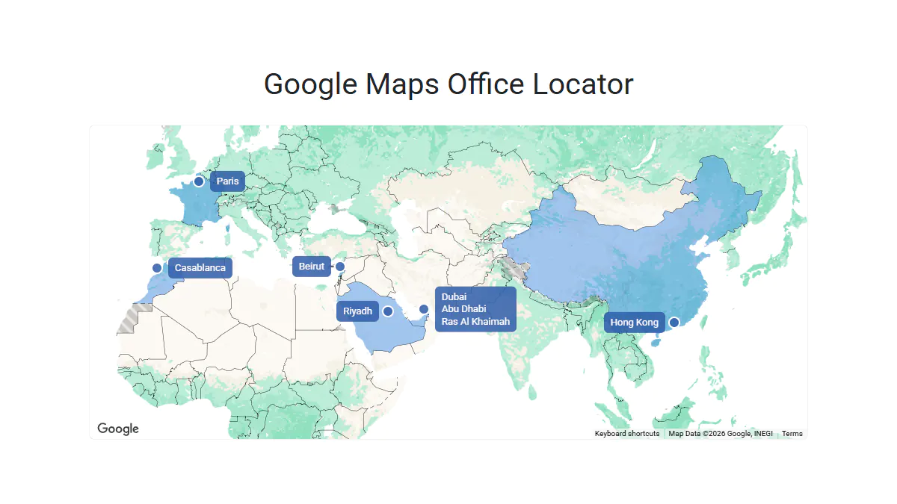
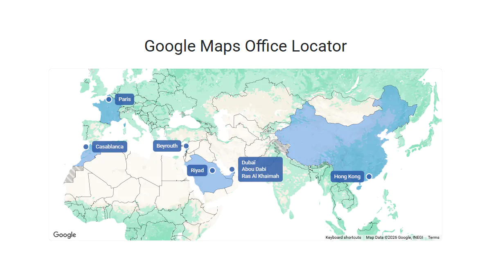

# Google Maps Office Locator

A JavaScript component for Google Maps that displays company offices on a customized world map
using country highlighting, custom markers, labels with links, and built-in localization.
Nearby cities can be grouped into a single label.

**Live Demo:** https://demo.arsen.pro/integrations/google-maps-office-locator/


## Screenshots

### English

<kbd>
  
</kbd>

### French

<kbd>
  
</kbd>


## Features

* Office country highlighting
* Custom markers
* Custom labels with links
* Grouped labels for nearby locations
* Localized city names and URLs
* Responsive map layout
* Adaptive initial zoom
* Lazy loading of the Google Maps API


## Technologies

* Google Maps API
* JavaScript (ES6+)
* HTML5
* CSS3


## How to Use

### Setup

Include `office-locator.css` and `office-locator.js`.


### Markup

```html
<div id="office-locator" class="gmol" data-lang="en"></div>
```

**Note:** The `data-lang` attribute can be either `en` or `fr`.
If omitted or language is unavailable, `en` is used as a fallback.


### Initialization

```js
const root = document.getElementById('office-locator');

const apiKey = 'YOUR_API_KEY';
const mapId  = 'YOUR_MAP_ID';

const offices = [
  // Office objects (see "Office Data" below)
];

new GoogleMapsOfficeLocator(root, { apiKey, mapId, offices });
```


## Options

| Option                     | Type     | Default                 | Description                                              |
|----------------------------|----------|-------------------------|----------------------------------------------------------|
| `apiKey`                   | `string` | `'YOUR_API_KEY'`        | Google Maps API key                                      |
| `mapId`                    | `string` | `'YOUR_MAP_ID'`         | Google Maps map ID                                       |
| `scriptId`                 | `string` | `'gmol-api'`            | Script ID for loading Google Maps API. Must be unique    |
| `baseUrl`                  | `string` | `'https://website.com'` | Base URL for city links                                  |
| `mapBounds`                | `object` | `{...}`                 | Map boundaries                                           |
| `mapBounds.north`          | `number` | `75`                    | Northern latitude                                        |
| `mapBounds.south`          | `number` | `-40`                   | Southern latitude                                        |
| `mapBounds.west`           | `number` | `-180`                  | Western longitude                                        |
| `mapBounds.east`           | `number` | `180`                   | Eastern longitude                                        |
| `classes`                  | `object` | `{...}`                 | CSS class names                                          |
| `classes.dragging`         | `string` | `'gmol--dragging'`      | CSS class added to the map container while dragging      |
| `classes.marker`           | `string` | `'gmol__marker'`        | CSS class for marker                                     |
| `classes.label`            | `string` | `'gmol__label'`         | CSS class for label                                      |
| `classes.labelLeft`        | `string` | `'gmol__label--left'`   | CSS class for left-positioned label                      |
| `classes.labelRight`       | `string` | `'gmol__label--right'`  | CSS class for right-positioned label                     |
| `classes.labelLink`        | `string` | `'gmol__label-link'`    | CSS class for label link                                 |
| `countryStyle`             | `object` | `{...}`                 | Styles for highlighting office countries                 |
| `countryStyle.fillColor`   | `string` | `'hsl(212, 80%, 50%)'`  | Country fill color                                       |
| `countryStyle.fillOpacity` | `number` | `0.4`                   | Country fill opacity                                     |
| `offices`                  | `array`  | `[...]`                 | Array of office objects. See [Office Data](#office-data) |


## Office Data

Each office is represented by an `object` with the following properties:

| Property         | Type               | Description                                                        |
|------------------|--------------------|--------------------------------------------------------------------|
| `country`        | `string \| object` | Country name. Supports localization                                |
| `countryId`      | `string`           | Google `Place ID`                                                  |
| `position`       | `object`           | Google `Location` coordinates (`lat` and `lng`)                    |
| `labelPlacement` | `string`           | Label position. Can be `'left'` or `'right'`                       |
| `cities`         | `array`            | Array of city objects. Both `name` and `link` support localization |


### How to Find Place IDs and Coordinates

To obtain `countryId` and `position`, use the following Google Maps tools:

* [Place ID Finder](https://developers.google.com/maps/documentation/javascript/examples/places-placeid-finder)
* [Geocoding API](https://developers.google.com/maps/documentation/geocoding/guides-v3/overview#place-id)


### Single Location Example

```js
{
  country: 'France',
  countryId: 'ChIJMVd4MymgVA0R99lHx5Y__Ws',
  position: { lat: 48.857548, lng: 2.351377 },
  labelPlacement: 'right',
  cities: [{
    name: 'Paris',
    link: '/paris',
  }],
}
```


### Multiple Locations Example

**Note:** Each localizable property can be either a string or an object keyed by language code.
Only the values that require translation need to be localized.

```js
{
  country: { en: 'UAE', fr: 'ÉAU' },
  countryId: 'ChIJvRKrsd9IXj4RpwoIwFYv0zM',
  position: { lat: 25.204849, lng: 55.270783 },
  labelPlacement: 'left',
  cities: [{
    name: { en: 'Dubai', fr: 'Dubaï' },
    link: { en: '/office-in-dubai', fr: '/bureau-a-dubai' },
  }, {
    name: { en: 'Abu Dhabi', fr: 'Abou Dabi' },
    link: '/abu-dhabi',
  }, {
    name: 'Ras Al Khaimah',
    link: { en: '/office-in-rak', fr: '/bureau-a-rak' },
  }],
}
```